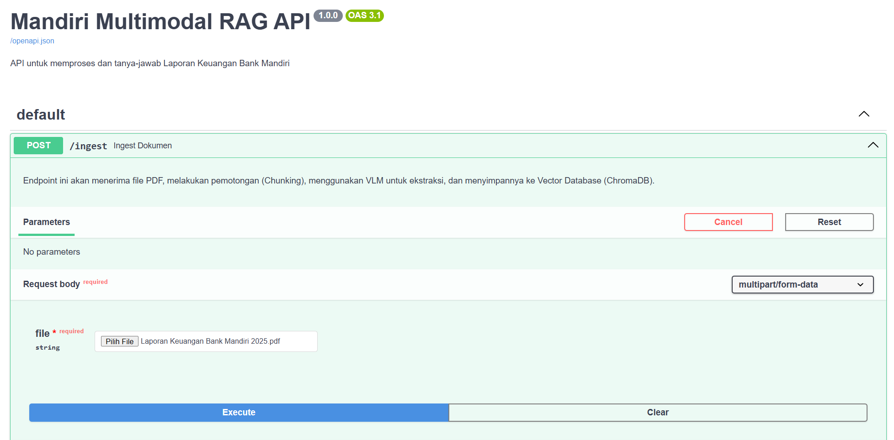
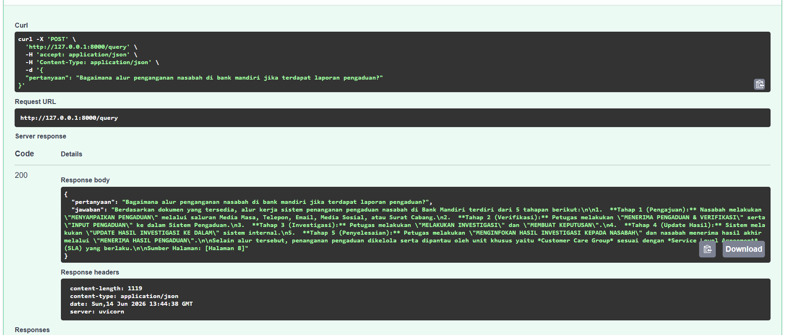
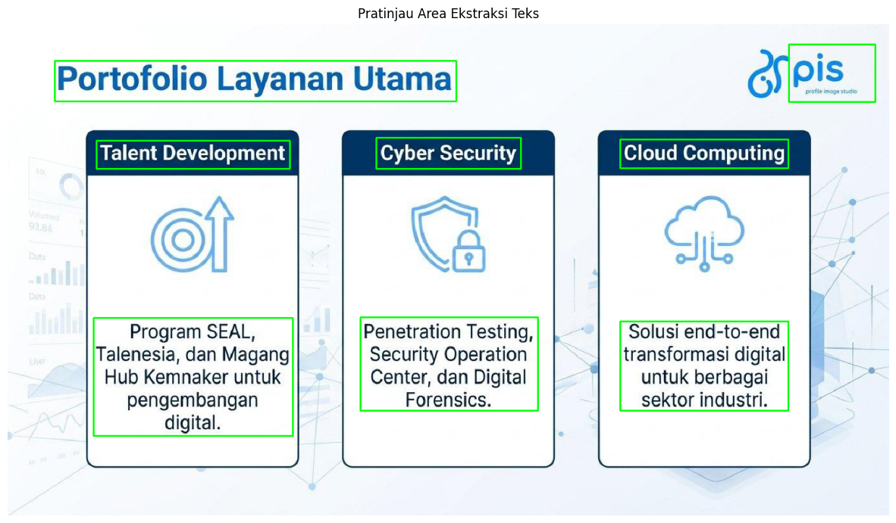
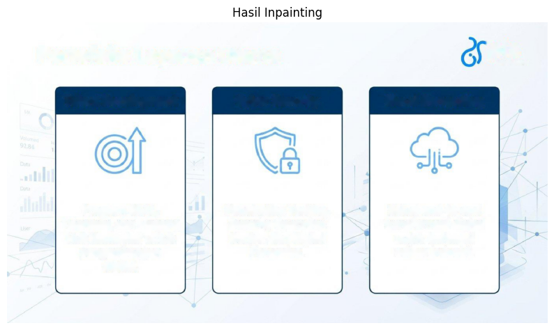
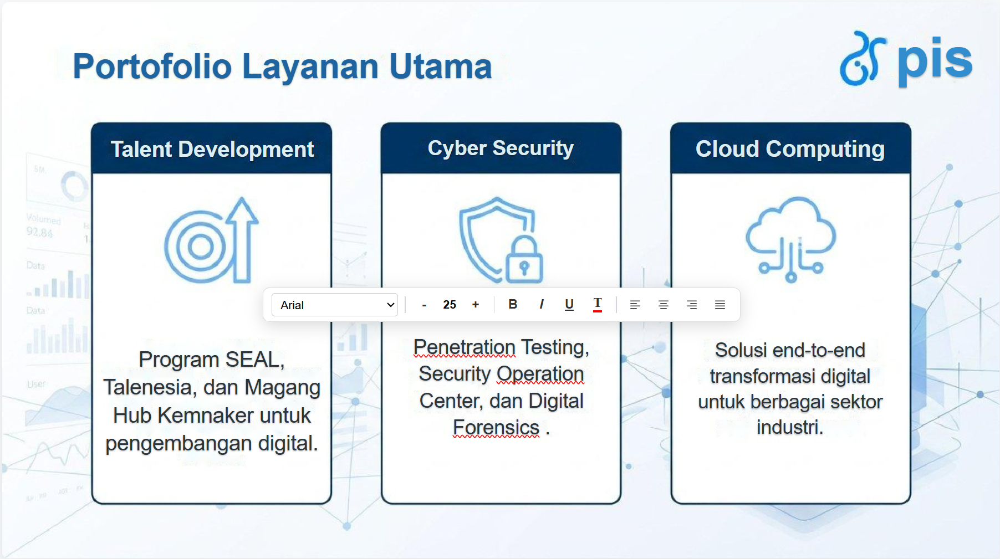

# Technical Test – Retrieval Augmented Generation & Layout-Aware Text Extraction
Repository ini berisi implementasi solusi untuk **AI Engineer Intern Technical Test** yang terdiri dari dua studi kasus utama:

## A. Multimodal Retrieval-Augmented Generation (RAG)

Membangun pipeline Retrieval-Augmented Generation (RAG) yang mampu mengubah dokumen PDF kompleks menjadi knowledge base yang dapat ditanyakan menggunakan bahasa alami.

Sistem menerima dokumen PDF yang berisi kombinasi teks, tabel, grafik, dan infografis, kemudian melakukan ekstraksi informasi, chunking, embedding, penyimpanan ke vector database, hingga menghasilkan jawaban berbasis konteks dokumen.

Output utama berupa REST API berbasis FastAPI yang menyediakan endpoint untuk proses ingestion dokumen dan question answering.

---

## B. Layout-Aware Text Extraction

Membangun pipeline Computer Vision yang mampu mengubah gambar slide presentasi menjadi halaman HTML dengan memisahkan elemen teks dari elemen latar belakang.

Sistem melakukan deteksi teks, ekstraksi posisi (bounding box), estimasi gaya visual (warna dan ukuran font), serta menghasilkan representasi HTML yang mempertahankan tata letak semirip mungkin dengan slide asli.

Tujuan utama pendekatan ini adalah memungkinkan teks diedit secara terpisah tanpa merusak elemen visual pada background.

---

# 🏗️ Tech Stack & Architecture

### Framework & API

* FastAPI
* Uvicorn
* Pydantic

### Tugas A – Multimodal RAG

* Google Gemini
* LangChain
* ChromaDB
* HuggingFace Embeddings (`all-MiniLM-L6-v2`)
* PDF2Image
* Pillow

### Tugas B – Layout-Aware Text Extraction

* OpenCV
* EasyOCR
* NumPy
* HTML & CSS Rendering
* Inpainting (Telea Method)

---

# ⚙️ Instalasi & Persiapan (Setup)

### 1. Clone Repository

```bash
git clone https://github.com/USERNAME/REPOSITORY_NAME.git

cd REPOSITORY_NAME
```

### 2. Membuat Virtual Environment

```bash
python -m venv venv
```

### Mac / Linux

```bash
source venv/bin/activate
```

### Windows

```bash
venv\Scripts\activate
```

### 3. Install Dependency

```bash
pip install -r requirements.txt
```

### 4. Konfigurasi Environment Variable

Buat file `.env` pada root project:

```env
GEMINI_API_KEY=your_api_key_here
POPPLER_PATH=C:\poppler\Library\bin
```

---

# Menjalankan Aplikasi

## A. Multimodal Retrieval-Augmented Generation (RAG)

Masuk ke folder Tugas A:

```bash
cd Bagian-A-Multimodal-Retrieval-Augmented-Generation
```

Jalankan FastAPI:

```bash
uvicorn app.main:app --reload
```

Server akan berjalan pada:

```text
http://127.0.0.1:8000
```

Swagger UI dapat diakses melalui:

```text
http://127.0.0.1:8000/docs
```

### Endpoint yang Tersedia

#### POST `/ingest`

Digunakan untuk mengunggah dokumen PDF dan membangun Knowledge Base.

#### POST `/query`

Digunakan untuk mengajukan pertanyaan berdasarkan dokumen yang telah diproses sebelumnya.

## B. Layout-Aware Text Extraction

Masuk ke folder Tugas B:

```bash
cd Bagian-B-Layout-Aware-Text-Extraction
```

Jalankan Jupyter Notebook:

```bash
jupyter notebook
```

Kemudian buka notebook:

```text
notebook/layout_aware_text_extraction.ipynb
```

Jalankan seluruh sel (Run All) secara berurutan.

---

# Struktur Repository

```text
AI-Engineer-Technical-Test
│
├── Bagian-A-Multimodal-Retrieval-Augmented-Generation
│   ├── app
│   ├── data
│   ├── notebook
│   └── mandiri_chroma_db
│
├── Bagian-B-Layout-Aware-Text-Extraction
│   ├── notebook
│   ├── output
│   └── samples
│
├── docs 
│   ├── swagger-ui.png
│   ├── query-result.png
│   ├── original-slide.png
│   ├── bounding-box.png
│   ├── clean-background.png
│   └── generated-html.png
│
├── .env.example
├── requirements.txt
└── README.md
```

---

# Sample Dataset

Repository ini menyertakan data uji yang digunakan selama proses pengembangan.

### Tugas A

* Laporan Keuangan Bank Mandiri 2025 (PDF)

### Tugas B

* Sample slide presentation (.jpg)

---

# 🧠 Pendekatan & Metodologi

## Tugas A – Multimodal Retrieval-Augmented Generation

Pipeline dibangun untuk menangani dokumen PDF yang mengandung kombinasi teks, tabel, dan elemen visual.

### Alur Proses

```text
PDF
 ↓
PDF to Image
 ↓
Gemini Vision Parsing
 ↓
Document Metadata
 ↓
Chunking
 ↓
Embedding
 ↓
ChromaDB
 ↓
Retrieval
 ↓
Gemini LLM
 ↓
Answer + Page Citation
```

### Endpoint `/ingest`

Fungsi:

* Upload dokumen PDF
* Konversi PDF menjadi gambar per halaman
* Ekstraksi informasi menggunakan Gemini Vision
* Chunking dokumen
* Embedding menggunakan model lokal
* Penyimpanan ke ChromaDB

### Endpoint `/query`

Fungsi:

* Menerima pertanyaan pengguna
* Melakukan semantic retrieval ke ChromaDB
* Menyusun jawaban berbasis konteks menggunakan Gemini
* Menampilkan referensi halaman dokumen sebagai metadata sumber

---

## Tugas B – Layout-Aware Text Extraction

Pipeline dirancang untuk mempertahankan tata letak visual slide semirip mungkin dengan gambar asli.

### Alur Proses

```text
Input Slide
 ↓
OCR Detection
 ↓
Bounding Box Analysis
 ↓
Style Extraction
 ↓
Background Cleaning
 ↓
HTML Generation
 ↓
Interactive HTML Output
```

### Fitur Utama

#### OCR-Based Text Extraction

Menggunakan OCR untuk mengekstraksi teks beserta posisi koordinat setiap elemen pada slide.

#### Layout Preservation

Posisi teks dipertahankan berdasarkan bounding box sehingga hasil HTML memiliki struktur yang mendekati tampilan asli.

#### Style Reconstruction

Sistem mengestimasi atribut visual seperti:

* Ukuran font
* Warna teks
* Posisi elemen

untuk meningkatkan kemiripan antara HTML dan slide sumber.

#### Background Cleaning

Menggunakan teknik inpainting untuk menghapus teks asli dari gambar sehingga elemen HTML dapat ditampilkan tanpa efek duplikasi.

#### Editable HTML Layer

Teks hasil ekstraksi dirender sebagai elemen HTML terpisah sehingga dapat dimodifikasi tanpa mempengaruhi background.

---

# 📸 Hasil Implementasi

## Tugas A

### Swagger API



### Query Result



---

## Tugas B

### Original Slide


### Bounding Box Detection



### Clean Background



### Generated HTML



---
```
```
